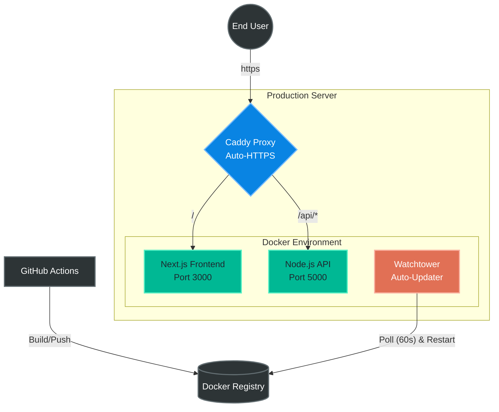

# ⚡ Threat Matrix 

[](#)
[](#)
[](#)
[](#)
[](https://opensource.org/licenses/MIT)

**Threat Matrix** is a real-time, 3D WebGL visualization dashboard that tracks and displays global cyber-attack vectors. Built with a modern Next.js frontend and a Node.js backend, it features automated data interpolation and a fully automated, zero-downtime CI/CD deployment pipeline.

🌍 **Live Demo:** [https://threatmatrix.duckdns.org](https://threatmatrix.duckdns.org) *(Note: Requires active session)*

---

## ✨ Key Features

- **Interactive 3D WebGL Globe:** High-performance, hardware-accelerated rendering of global network traffic.
- **Phantom Beam Interpolation:** Custom trigonometric algorithms automatically generate "Orbital Strike" and "Scattershot" visual clusters when origin or target IP coordinates are masked/multiple.
- **Automated CI/CD Pipeline:** GitHub Actions builds and pushes Docker images on every commit, while Watchtower automatically handles zero-downtime rolling updates on the production server.
- **Self-Healing Infrastructure:** Caddy reverse-proxy automatically negotiates, provisions, and renews Let\'s Encrypt SSL/TLS certificates without manual intervention.
- **Modular UI Controls:** Toggleable vector legends, live monitoring sidebars, and adjustable playback speeds.

---

## 🏗️ System Architecture

The application is fully containerized and runs on an Oracle Cloud infrastructure. 



## 🚀 Tech Stack

Frontend: Next.js, React, TailwindCSS, WebGL (Globe.gl)

Backend: Node.js, Express

DevOps & Deployment: Docker, Docker Compose, GitHub Actions, Watchtower, Caddy Server, Oracle Cloud (Ubuntu)

## 🛠️ Local Development

Want to run this locally? It takes less than 2 minutes.

### Prerequisites

Docker Desktop installed and running.

Git installed.

### Installation

Clone the repository

```bash
git clone [https://github.com/Chinkhuselts/threatmap-saas.git](https://github.com/Chinkhuselts/threatmap-saas.git)
cd threatmap-saas
```

### Set up Environment Variables

Create a .env file in the root directory and configure your backend routing:

```
NEXT_PUBLIC_API_URL=http://localhost:5000/api
```

### Spin up the Containers

```bash
docker-compose up -d --build
```

### View the App

Open your browser and navigate to http://localhost:3000.

## 🚢 Production Deployment

This repository is configured for automated deployments. Pushing to the main branch triggers the following sequence:

GitHub Actions lints the code, builds the production Docker image, and pushes it to the container registry.

Watchtower (running on the production server) detects the new image signature within 60 seconds.

Watchtower pulls the new image, gracefully shuts down the old containers, and spins up the new version.

Old, dangling Docker images are automatically pruned to prevent storage bloat.

### Note on SSL: 

Do not run Certbot. The production server uses a global Caddyfile that automatically routes all HTTP traffic to HTTPS and manages TLS certificates on the fly.

## 📜 License

This project is licensed under the MIT License - see the LICENSE.md file for details.
