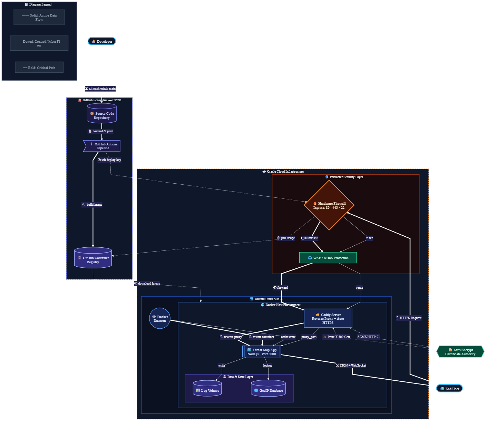

# Global Cyber Threat Map

A real-time traffic visualization system designed to track and display global network anomalies. 

This project goes beyond simple data visualization. It serves as a live, end-to-end demonstration of modern DevOps practices, taking a raw Node.js application and wrapping it in a secure, containerized, and fully automated deployment pipeline.

**Visualization: https://security-map.duckdns.org/**

## 🗺️ System Architecture


*Architecture flow: From local Git push to automated CI/CD container registry, deployed to a secured Oracle Cloud VM with Caddy handling Let's Encrypt SSL termination.*

## 📊 Custom Data Injection (CSV Upload)
While the application features a built-in "Demo Mode" for testing the visualizer, it is designed to ingest and map real-world network logs. You can visualize your own firewall logs, honeypot traffic, or DDoS attack captures by uploading a custom CSV file.

### CSV Syntax & Schema
To ensure the 3D rendering engine plots the coordinates correctly, your CSV file must include specific headers. The parser is strict about the column names. 

**Required Columns:**
* `source_ip`: The IPv4 address of the origin (the attacker/sender).

**Optional (but recommended) Columns:**
* `timestamp`: The time of the event (ISO 8601 format or Epoch).
* `port`: The destination port being targeted (e.g., 80, 443, 22).
* `type`: The classification of the traffic (e.g., `DDoS`, `SSH Brute Force`, `Port Scan`).

### Example `data.csv`
```csv
timestamp,source_ip,target_ip,port,type
2026-05-21T10:00:00Z,198.51.100.23,207.127.95.57,443,HTTPS Traffic
2026-05-21T10:00:02Z,203.0.113.89,207.127.95.57,22,SSH Brute Force
2026-05-21T10:00:05Z,45.33.32.156,207.127.95.57,80,DDoS
```

## 🚀 The "Why"
I built this project to bridge the gap between "writing code" and "running production infrastructure." The goal wasn't just to make the map work, but to make it *durable*. 

I wanted to ensure that if I push a single line of code to GitHub, my infrastructure automatically builds, tests, deploys, and secures that update without me ever having to touch the server manually.

## 🛠 Tech Stack
* **Frontend:** HTML5, JavaScript, Three.js (for high-performance 3D rendering).
* **Backend:** Node.js & Express.
* **Containerization:** Docker (ensuring environment parity between dev and prod).
* **CI/CD:** GitHub Actions (the engine for the automated build-and-deploy pipeline).
* **Reverse Proxy & SSL:** Caddy (handles automatic HTTPS via Let's Encrypt).
* **Cloud Infrastructure:** Oracle Cloud (Ubuntu VM).

## 🏗 Architectural Highlights
As illustrated in the diagram above, this application is architected for strict security and reliability:

* **Automated CI/CD Pipeline:** Every push to the `main` branch triggers a workflow that containerizes the application, pushes it to the GitHub Container Registry, and securely deploys it to the production server. 
* **Container-First Workflow:** By using Docker, the application is decoupled from the host OS. It runs exactly the same in my local environment as it does on the cloud server.
* **Secure Reverse Proxy (SSL Termination):** Caddy sits at the edge of the network. It automatically manages SSL/TLS certificates via the ACME challenge and handles all HTTPS traffic, ensuring secure connections.
* **Resilient Networking:** The infrastructure is hardened with specific Oracle Cloud hardware firewall rules, dropping all unverified packets and allowing only strictly necessary traffic (HTTP/HTTPS) to reach the application.

## 📦 How to Run Locally
If you want to view or contribute to the map, it takes just a few commands to get it running in an isolated container:

1. **Clone the repo:**
   ```bash
   git clone [https://github.com/yourusername/cyber-threat-map.git](https://github.com/yourusername/cyber-threat-map.git)
   cd cyber-threat-map
   ```
2. **Build the container:**
   ```bash
   docker build -t threat-map .
   ```
3. **Run the container:**
   ```bash
   docker run -p 3000:3000 threat-map
   ```
4. Access the app: Open http://localhost:3000 in your browser.

## 📈 The Journey
This project was a deep dive into the following DevOps phases:

* Application Logic: Building the visualization engine and data handling.
* Containerization: Defining the environment and entry points via Dockerfile.
* CI/CD Orchestration: Configuring GitHub Actions for hands-off deployment.
* Infrastructure Hardening: Securing the Linux VM and configuring network ingress rules.
* HTTPS Implementation: Managing global DNS propagation and the ACME challenge lifecycle for secure, trusted access.

Built with passion for robust infrastructure and clean, performant code.
